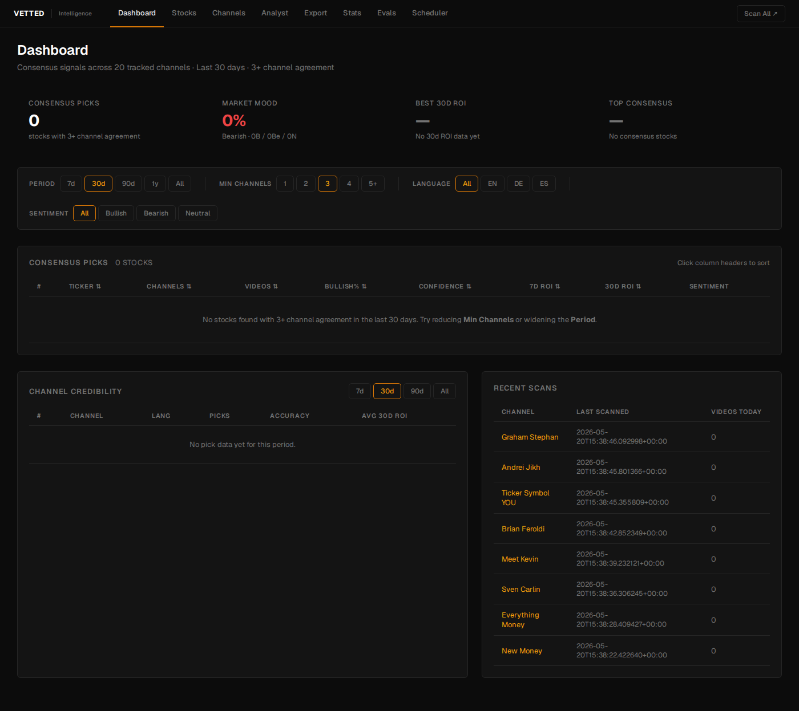
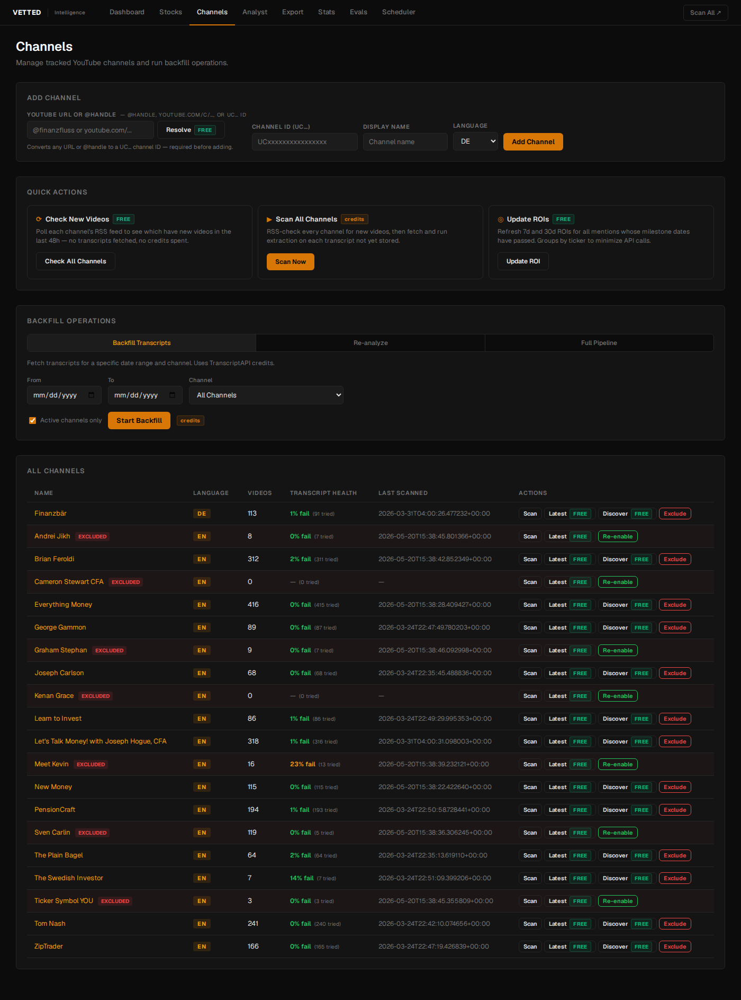
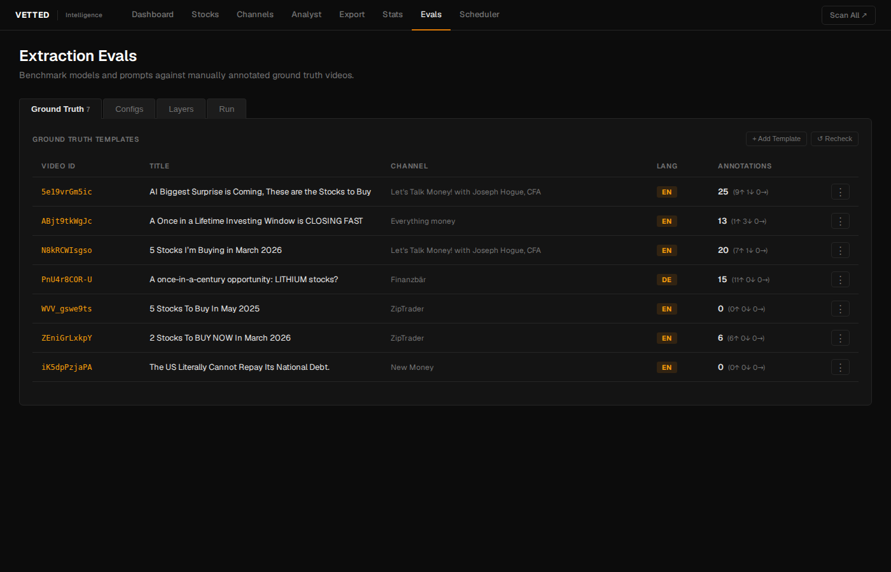

# Vetted — Alternative-Data Pipeline for Finance YouTube

Vetted scans 20 tracked finance YouTube channels daily, extracts every stock mention using a multi-pass Claude pipeline, tracks the real-world ROI of each pick, and surfaces the results through two web apps.



---

## What it does

1. **Fetches** new videos from tracked channels via TranscriptAPI's RSS endpoint (no YouTube quota cost).
2. **Extracts** stock mentions from transcripts using a three-pass LLM pipeline (discovery → analysis → hallucination-verification).
3. **Tracks ROI** for every pick: baseline price at publish date, then 7d / 30d / 90d / 1y milestones vs SPY/QQQ/EWG benchmark.
4. **Exposes** the data through an owner dashboard (full admin) and a consumer app (subscription-gated product).

---

## Screenshots

| Channels | Eval harness |
|---|---|
|  |  |

**Consumer app** (email + password auth, subscription tiers):


---

## Architecture

```
YouTube RSS / TranscriptAPI
        │
        ▼
   scanner.py          ← fetches new videos, stores transcripts
        │
        ▼
   brain.py            ← 3-pass Claude extraction pipeline
        │
        ▼
   vetted.db           ← SQLite: channels, videos, mentions, ROI
        │
   ┌────┴─────────────────────────┐
   ▼                              ▼
main.py (port 8000)     consumer/main.py (port 8001)
Owner dashboard         Consumer product
FastAPI + Jinja2        FastAPI + Jinja2
HTTP Basic Auth         Email/password + sessions
```

**Stack:** Python 3.12 · FastAPI · SQLite · APScheduler · Jinja2 · Chart.js · PM2 · Caddy

---

## Three-pass extraction (`brain.py`)

The core extraction runs three sequential Claude calls per video:

| Pass | Model | Temp | Task |
|---|---|---|---|
| 1 — Discovery | Haiku 4.5 | 1.0 | Find every investment vehicle in the transcript |
| 2 — Analysis | Haiku 4.5 | 0.7 | Extract sentiment, confidence, recommendation, context per ticker |
| 3 — Verification | Haiku 4.5 | 0.5 | Fact-check pass 2 against the raw transcript, drop hallucinations |

Hallucination is the primary risk: a wrong ticker or fabricated sentiment corrupts ROI silently. Pass 3 is the guard layer. Any model or prompt change must be benchmarked through the eval harness before going live.

---

## Eval harness (`evals/`)

A ground-truth eval system for iterating safely on the extraction pipeline:

- **Ground truth** — 7 manually-annotated videos (`evals/ground_truth/*.json`) with verified ticker/sentiment labels
- **Configs** — named pipeline configs (model combinations, pass counts, temperatures) in `evals/custom_configs/`
- **Runner** — executes any config against the ground truth set (`evals/runner.py`)
- **Scorer** — computes precision, recall, F2 (recall-weighted) per run (`evals/scorer.py`)
- **Results** — 60+ benchmark runs stored in `evals/results/` for comparison

---

## Key files

| File | Purpose |
|---|---|
| `brain.py` | Three-pass LLM extraction pipeline |
| `scanner.py` | Video fetching + transcript ingestion |
| `market_data.py` | Price sync (yfinance primary, Tiingo fallback) |
| `roi_updater.py` | ROI milestone computation vs market benchmarks |
| `channel_fetcher.py` | TranscriptAPI channel + RSS integration |
| `extract.py` | Transcript fetching helpers |
| `main.py` | Owner dashboard (FastAPI, port 8000) |
| `consumer/main.py` | Consumer product (FastAPI, port 8001) |
| `consumer/auth.py` | bcrypt password hashing + session auth |
| `consumer/limiter.py` | Per-IP rate limiting (slowapi) |
| `scheduler.py` | APScheduler jobs: daily scan, hourly ROI, nightly backup |
| `db_manager.py` | Schema management + migrations |

---

## Setup

```bash
python3 -m venv venv
source venv/bin/activate
pip install -r requirements.txt

cp .env.example .env
# Fill in: ANTHROPIC_API_KEY, TIINGO_API_KEY, YOUTUBE_API_KEY,
#          TRANSCRIPTAPI_KEY, DASHBOARD_PASSWORD

# Owner dashboard
uvicorn main:app --host 127.0.0.1 --port 8000 --reload

# Consumer app (separate terminal)
uvicorn consumer.main:app --host 127.0.0.1 --port 8001 --reload
```

---

## Data model (core tables)

| Table | Description |
|---|---|
| `channels` | 20 tracked YouTube channels, scan metadata |
| `videos` | Per-video metadata + raw transcript |
| `mentions` | Extracted picks: ticker, sentiment, confidence, recommendation |
| `roi_tracking` | Per-mention baseline price + current ROI |
| `roi_milestones` | ROI at 3/7/14/30/60/90/180/365d + benchmark-relative |
| `price_daily` | Daily close per ticker (yfinance / Tiingo) |
| `daily_sentiment` | Per-ticker per-day bullish/bearish/neutral aggregates |

ROI baseline rule: always the closing price on the video's publish date.

---

## Running the evals

```bash
# List available configs
python -m evals.runner --list

# Run a config against all ground-truth videos
python -m evals.runner --config three_pass_haiku

# Compare results
python -m evals.scorer --compare results/2026-03-22-*.json
```
